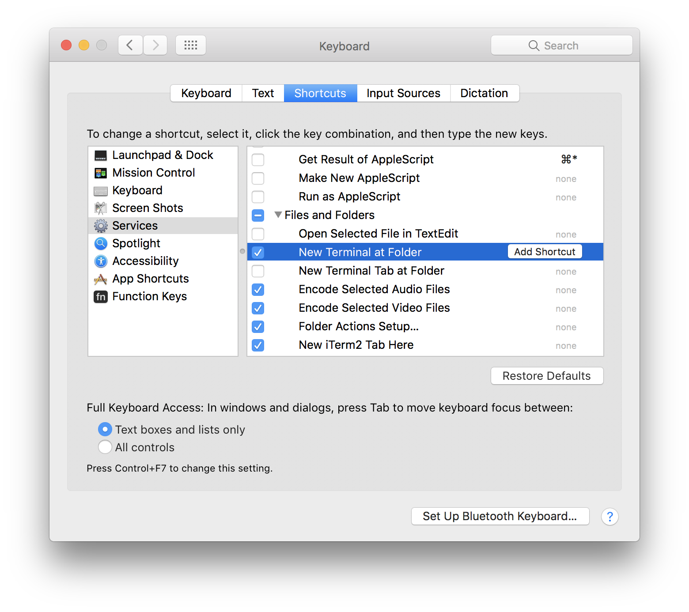
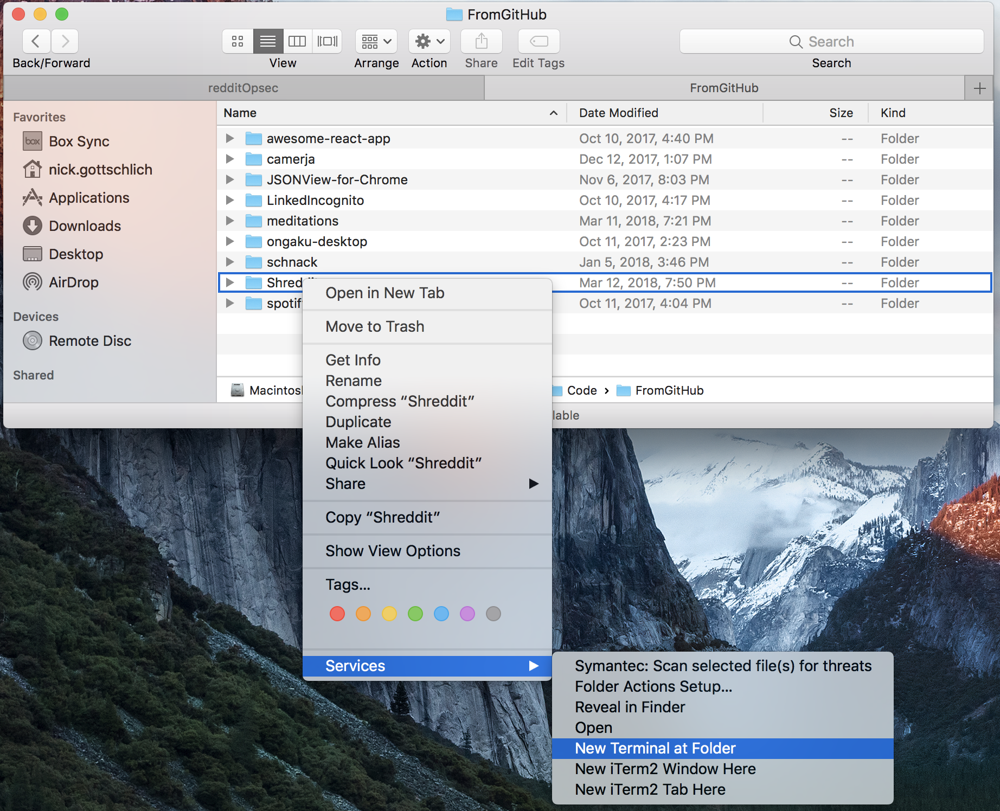
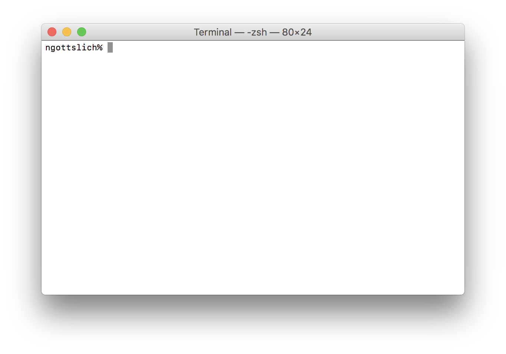

Nearly everyone in modern society has an online presence. Short of destroying all of your electronics and living on hunting and gathering in the woods, there is no way to truly escape it. This is just a reality of the world we live in. Whether you post photos on Facebook or Instagram, upvote memes on reddit, engage in online dating, or even just walk around with your phone's location services on, you are creating electronic footsteps that can be followed. It's important to remember that every click, swipe, word or piece of media you input is recorded and stored indefinitely. Often, it's all publicly available and gives away much more information then you might realize.

I'm not saying that everything is horrible. The internet has revolutionized how we live our lives in many incredible ways. Do you remember what it was like to navigate to a new place before google maps? Or how much of a pain it was to pay bills before it could be done online? But the downside of this incredible access to information, and the convenience it provides, means that many of us are now exposing our personal data in ways we don't understand, and this can have consequences beyond what we could predict.

So what can you do about it? How do you manage this risk and reduce the amount of data there is out there on you? How do you protect yourself while still enjoying the incredible benefits of online life?

## OPSEC

[Operations Security](https://en.wikipedia.org/wiki/Operations_security) aka OPSEC is, simply put, a way to stop people who might have bad intentions from getting ahold of your personal info. A military term, it can be adopted to civilian life in a world in which we are all constantly sharing and transferring lots and lots of sensitive information.

So why would you need OPSEC? You're probably not buying and selling drugs on the dark web, or a journalist trying to cover a hostile authoritarian regime (and if you are, you're gonna need a better guide than this). But consider this, would you share every intricate detail of your online activity with your grandmother? Your boss and coworkers? How about some strange and unknown corporation in China? 

Even if you answered yes to all of those (get real), you may want to consider the metadata that can be gleaned about you regardless of the actual content of what you post online. If you've got one, go ahead and enter your reddit user name into [SnoopSnoo](https://www.snoopsnoo.com/), or search through your comments with [redditCommentSearch](https://www.redditcommentsearch.com/). Consider experiments in which hackers have been able to determine [when their facebook friends are sleeping](https://mango.pdf.zone/graphing-when-your-facebook-friends-are-awake) or [triangulating the location of people on tinder](https://mango.pdf.zone/stalking-your-facebook-friends-on-tinder). Maybe it's worthwhile to clean up your internet presence, even if you are the online Mother Teresa.

### A Philosophical tangent

I don't believe in "If you have nothing to hide, you have nothing to be afraid of". Everyone has something they want to keep private. If you want to have a separate twitter or reddit account to post opinions or thoughts you don't want tied to your "IRL" identity, that's just fine. If you don't want your mother to see your search history, that doesn't make you a bad person. Some believe Oscar Wilde when he said "Give a man a mask, and he will show you his true face", but I believe people are capable of having more than one face. You will act differently while hanging out with your close friends then you will at a job interview, or while at a fancy event, or when speaking to your parents or kids. This is normal, and while some online communities engage in truly despicable behavior under the guise of anonymity, this does not mean wanting to be anonymous and take part in discussion anonymously is an evil or immoral act.

## What this is not

This will not be a guide on how to avoid getting hacked. If you are looking to ramp up your online security with regards to things like passwords, 2FA and whatnot I highly recommend MotherBoard's aptly named [Guide to Not Getting Hacked](https://motherboard.vice.com/en_us/article/d3devm/motherboard-guide-to-not-getting-hacked-online-safety-guide). It will walk you through everything you need to know about how to be safe online and avoiding having your accounts hijacked or have other digital misfortune fall upon you.

I also will do my best to avoid any OPSEC techniques that cause drastic hits to the convenience and benefits the internet provides. Yes, you should use TAILS and TOR if you want to be as safe as possible, but doing that sucks and is overkill for most "normal" people. Yes, you should probably turn off location services on your phone most of the time, but show me a person who says they never use Google navigation and I will show you a god damn liar. The goal here is to get you your best "bang for your buck". To provide you with the best OPSEC for the smallest hit to your internet lifestyle.

## What this is

These posts will focus on how to vacuum up as many of those digital breadcrumbs as possible. Scrub out your old reddit comments, remove old twitter likes and retweets, clear out the facebook posts from 3 years ago, and ideally do all this automatically, on a schedule, and without having to think about it. No, you don't have to be a professional programmer to do this, nor do you even need to know how to program at all. You can do this by being resourceful and taking advantage of tools that are already made, as well as applying a bit of ingenuity here and there.

So without further ado, let's get started on lesson number one:

# Automatically cleaning old reddit comments

*Note: This is written for Mac users, if there is popular demand I'll write a version for Windows as well. Many of the tools I use here can be substituted for Windows equivalents for those who are adventurous.*

We will be using an open-source project called [Shreddit](https://github.com/x89/Shreddit). Shreddit connects to reddit using an [API](https://en.wikipedia.org/wiki/Application_programming_interface), or Application Programming Interface. Basically, the developers of reddit have created a set of tools that allow people to access the site programatically, as opposed to using their user interface.

Shreddit seems to have been abandoned by it's developers, so I forked it over into my own GitHub account [here](https://github.com/Nick-Gottschlich/Shreddit) and fixed a few bugs that are lying within the code. This is where we will be getting the code for our purposes.


### Step One, get the code

We have to somehow get this code from the internet onto your computer. Let's download it from GitHub.

If you know how to `git clone` a repo, go ahead and do that. Otherwise you can just download the folder by clicking the green "Clone or download" button and then pressing "Download Zip". Then just extract the folder to wherever you would like to store it on your machine. I recommend making a new folder called "Code" somewhere, like in your main finder folder or in "Documents".

### Step Two, get Python

Shreddit is written in the programming language [Python](https://en.wikipedia.org/wiki/Python_%28programming_language%29). So first thing's first, let's get Python properly set up on your machine.

Open up your terminal: you can do this opening spotlight (CMD + Spacebar) and typing "terminal". Now you need to get to the folder where you have Shreddit installed. The easiest way to do this is:

- Open up your system preferences
- Click "Keyboard"
- Click "Shortcuts"
- Find the "New Terminal at Folder" option (under Services -> "Files and Folders"), and enable it



- Now go to *one folder up* from where your Shreddit folder is in your finder. 
- Right click (or two finger click) and select Services -> New Terminal At Folder



You should now see a terminal, it should look something like this:



We are going to use the [Brew Package Manager](https://brew.sh/) to get the version of Python we need on our system. In your terminal paste the following code and press enter:

`/usr/bin/ruby -e "$(curl -fsSL https://raw.githubusercontent.com/Homebrew/install/master/install)"`

Brew will install itself, follow any instructions if needed or otherwise let it do its thing. Once that is done, type `brew install python` in your terminal and press enter. Once again, let brew do its thing.

### Step Three, install some dependency code

Now we need to get Shreddit set up to be able to run. First, in your terminal, do `pip3 install -U shreddit`. Once that finishes, do `pip3 install -r requirements.txt`. Now you can run `shreddit -g`.

### Step Four, set up access to reddit

You need to create a connection point for your reddit account, follow these instructions to do so (taken from 
[PRAW documentation](http://praw.readthedocs.io/en/latest/getting_started/authentication.html#script-application)):

1. Open your Reddit application preferences by clicking [here](https://www.reddit.com/prefs/apps/).
2. Add a new application. It doesn't matter what it's named, but calling it "shreddit" makes it easier to remember.
3. Select "script".
4. Redirect URL does not matter for script applications, so enter something like http://127.0.0.1:8080
5. Once created, you should see the name of your application followed by 14 character string. Enter this 14 character string as your `client_id`.
6. Copy the 27 character "secret" string into the `client_secret` field.

Now, you will need to edit the `praw.ini` file that has been created in your shreddit folder. You can use any text editor you want. Fill it in with the data you just got from above, as well as your username and password.

```
[default]
client_id=f3FaKeD4t40PsJ
client_secret=dfK3pfMoReFAkEDaTa123456789
username=testuser
password=123passwordgoeshere123
```

### Step Five, configure Shreddit

Now you will need to open up the `shreddit.yml` file that was created (again, in a text editor). You can now modify any of the options in here to your liking. **Pay close attention to the option called `nuke_hours`!** Anything older than this amount of hours will be deleted on a Shreddit run, regardless of your other settings. Otherwise you can do things with these options like saving comments or posts over a certain upvote count, blacklisting certain subreddits from having your stuff deleted, etc. Take your time and look over all these options before actually running Shreddit. There's an option called `trial_run` I highly recommend setting on your first time to see exactly what will be deleted before going for real.

### Step Six, hit the go button

When you're ready, and you're sure you have configured your options correct, type `shreddit` in your terminal and press enter. Shreddit will go to work and you can watch it do it's thing. Your comments/posts will be overwritten with gibberish and then deleted.

### Step Seven (optional), automation

If you like, you can configure Shreddit to run everyday, ensuring that you are consistently wiping your reddit history without even having to worry about it.

In your terminal (still in the Shreddit folder), type this command: `cp praw.ini ~/.config` . This will copy your `praw.ini` file to a place where it can be assessed by a piece of automation software that's already built into your computer (called "Cron").

Okay, now things get a little bit confusing, so bare with me. Type this into your terminal: `pwd|pbcopy`. This will copy the path to your Shreddit folder into your clipboard (meaning, you can now paste that text with CMD+V). Now, in your terminal, type `VISUAL=nano crontab -e` and press enter. This will open up a simple text editor. Now, you are going to type `* 11 * * * shreddit -c`. Now press space once and paste in that path that's sitting in your keyboard, and then add on to the end of it `/shreddit.yml`. The whole thing should look like this (but with your own file path):

`* 11 * * * shreddit -c /Users/nick.gottschlich/Code/Shreddit/shreddit.yml`

Now to get out of this text editor, press CTRL+O (this will save the file), press Enter, then press CTRL+X to exit.

That's it! Cron will now run shreddit at 11am everyday (as long as your laptop is on at that point). To learn more about how Cron works and configure it yourself, see [this guide](http://www.adminschoice.com/crontab-quick-reference).

Other than that, you're good to go, Shreddit should now run daily and keep your reddit history clean and pristine. Good job on taking a step to clean up your internet presence and increase your OPSEC!

## Final Note: Pitfalls

I would just like to state firmly that there is no guarantee this will rid the internet of your reddit history completely and permanently. Various archives exist of reddit posts and comments (see [here](https://archive.org/details/2015_reddit_comments_corpus) and [here](https://www.reddit.com/r/datasets/comments/3bxlg7/i_have_every_publicly_available_reddit_comment/)), both those made public and unknown private copies. At the end of the day, the best defense is, well, not posting things on reddit.

But this guide is about mitigating your risk while still getting to engage in the features that a community like reddit provides. It's important to note that these archives take more effort and time to find and scan through, and that they represent only the slice of reddit that exists at the time the archive was made. Consistently deleting your posts will dramatically reduce the surface area that lives out there, it will dissuade the casual stalker or malicious perpetrator, will make it harder to build up an online profile about you, and will also have minimal effects on the way you use the site.