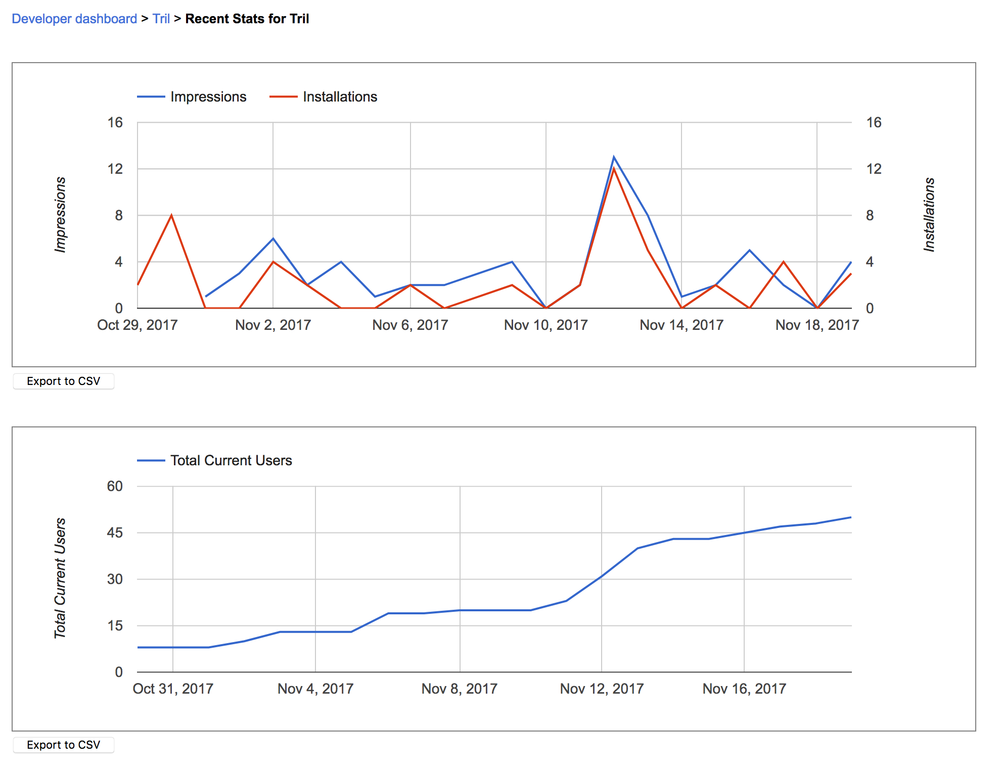

A little bit earlier this year I found a [reddit post](https://redd.it/5xnvn9) which swapped the twitter accounts of [dril](https://twitter.com/dril) and [President Trump](https://twitter.com/realdonaldtrump) to amusing effect. I thought, hey, I've always wanted to learn how chrome extensions work, and I bet I could make a chrome extension that does this! [So I Did](https://chrome.google.com/webstore/detail/tril/dkneemnajjjblcgpdfpmcmihdjclpopj) (and I'd like to give thanks to my friend and coworker [Richard Lindsey](https://twitter.com/Velveeta) who helped me figure out a few pieces of that puzzle).

But I will save the gory details of how I built this chrome extension for another post. What I want to talk about today was what happened afterwords.

On November 11th, twitter user `@riseuphes` posted this tweet, which got over 200,000 retweets and 600,000 likes:

<blockquote class="twitter-tweet" data-lang="en">
I have a chrome extension that makes all of trump&#39;s tweets seem like they were written in crayon. This one is just a little too real for my taste. <a href="https://t.co/XOstjKKKy3">pic.twitter.com/XOstjKKKy3</a>
&mdash; sanjana (`@riseuphes`) <a href="https://twitter.com/riseuphes/status/929579600354693120?ref_src=twsrc%5Etfw">November 12, 2017</a></blockquote>

Twitter user `@a_vansi` responded with this tweet, which got about 400 retweets and 2,000 likes:

<blockquote class="twitter-tweet" data-conversation="none" data-lang="en">
I have a chrome extension that switches Trump and <a href="https://twitter.com/dril?ref_src=twsrc%5Etfw">@dril</a>&#39;s profiles <a href="https://t.co/JacW0lmAQq">pic.twitter.com/JacW0lmAQq</a>
&mdash; aaron vansintjan (@a_vansi) <a href="https://twitter.com/a_vansi/status/929679560534347776?ref_src=twsrc%5Etfw">November 12, 2017</a></blockquote>

Look mom! I'm famous! Someone who works for [The Daily Show](https://twitter.com/Anthony/status/929890641257156609) is interested in my extension! Clearly this is the start of big things for me.

Unfortunately, I didn't check in on twitter until November 19th, a whole 5 days after this exchange took place (serves me right for not constantly being jacked into social media, a mistake I won't make again). `@a_vansi` did credit me in responses to their tweet, and linked to my twitter account (which did have a tweet about the Tril extension pretty high up at that point). When I finally stumbled upon the twitter thread I started providing links and responses.

So what did you think happened? Was there a massive flurry of activity surrounding my chrome extension? Where people downloading it like mad and sharing it with the world?

Well, not exactly. I did see a peak in downloads, garnering a massive 12 downloads on November 12th and 13 impressions, and 4 more downloads on November 19th. But I sure as hell ain't flying away on my private jet to Hawaii with those numbers.

So why didn't I fare better? Some thoughts:

- This app is a joke (literally). It's not only useless, it's worse than useless. It actively falsifies the content that is coming through to the end user from twitter. I figure most people saw the tweet, looked at the images and thought "Ha! That's pretty funny/clever", smashed that like button and moved on with their lives.
  - One counter point to this is that the original crayon extension mentioned [Make Trump Tweets Eight Again](https://chrome.google.com/webstore/detail/make-trump-tweets-eight-a/iopebbikefjcknnbmdkkcebchlnaioen/related?hl=en) has about 63,000 users currently, but it also has the marketing backing of The Daily Show.
- I missed the initial period to drop a direct link to the extension. `@a_vansi` did post a link to my twitter account [here](https://twitter.com/a_vansi/status/929798857160101889) but I imagine most people didn't realize or didn't bother to click through, find the tweet on my page with the link to the Tril extension, and then click through on that to download extension. Oh well.
- People are hesitant to download chrome extensions from sources they don't trust. This seems unlikely as people will shovel whatever software they so much as glance at onto their machine without a second thought (*guilty*). Also, I made the [source code](https://github.com/Nick-Gottschlich/Tril) available and linked it direct from the extension, so anyone who was concerned could check out the code for themselves.

So what does this all mean? I'm not sure really. It could mean that the world does not care for gimmicky useless chrome extensions (shocking!). It could mean that viral advertising truly is a fickle beast. It could mean that people on twitter don't really bother to engage with the content in posts but instead just click like, retweet and/or just move on.

Regardless, I'm excited something I made as a joke got some attention in the first place, and am thrilled it brought an interesting story for me to tell.

\- Nick Gottschlich
