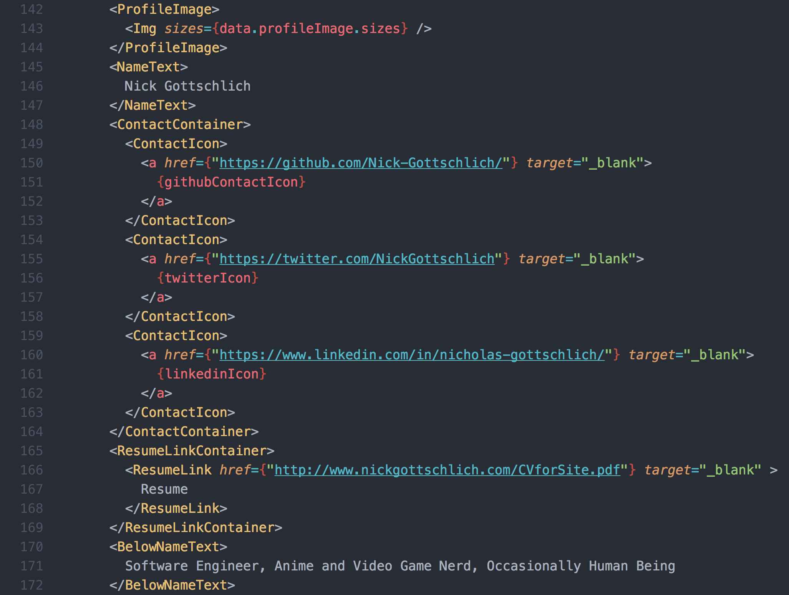

Happy 🦃thanksgiving🦃! I've decided to use my free time this break to rebuild my website from scratch. I'm using some really cool new technologies for this, and I'm going to run through each of them and how they contributed to the site.

## Gatsby

[Gastby](https://www.gatsbyjs.org/) is a [static site](https://en.wikipedia.org/wiki/Static_web_page) generator that uses the [React](https://reactjs.org/) framework. What does all of that mean? Well a static web page is delivered to the user exactly as stored. Unlike a dynamic website like twitter or facebook that has constantly changing content submitted by users, the content on my web page only updates when I want it to. This means I don't need any sort of back end server setup, I can consolidate everything on my webpage into a package of HTML, Javascript and CSS and deliver it quickly to the user.

You might notice how quick it is to click around the site (try clicking on the links at the top and then coming back here), that's because of React! React allows you to build a website in components, and then only re-render the components on the page that change. So if you click on "About", React recognizes that the header at the top of the screen doesn't need to change, and only reloads the body content. This makes webpages feel more like downloaded applications.

## Styled Components

[Styled Components](https://www.styled-components.com/) are a type of CSS in JS. What that means in practice is you write your CSS right in your Javascript file. If you wanted to create a header, it might look something like this:

```javascript
import styled from "styled-components"

const Header = styled.h1`
  padding-top: 20px;
  color: plurple;
`
```

and then in your render function you would put

```
<Header>
  My header!
</Header>
```

One of my favorite things about styled components is it makes it trivial to read someone else's code at a glance. Here's a screenshot of some code from my "About me" page, see if you can you figure out what's going on:



Ah, isn't that nice? No more wondering what's in that mysterious `div`, it's the `<ProfileImage>` instead.

It's important to note that Styled Components are very restrictive in what they effect. If I apply `color: chartreuse` to the `<ContactContainer>` it will *not* cascade down to the `<ContactIcon>` unless I use a nested selector. There are pros and cons to this, it does make it very clear what css styles are applied to which component, but it can mean finicking with nested selectors or extended components if you actually want to cascade down (aka the 'C' in 'CSS'). If your website is highly componentized Styled Components may be exactly what you're looking for, but if you need that cascading behavior you may want to look elsewhere.

## GraphQL

[GraphQL](http://graphql.org/learn/) is a data query language built into Gatsby. I use it in this site to automatically create blog posts from `.md` files, and to query the images and other assets. To learn more about this process, see [part 4](https://www.gatsbyjs.org/tutorial/part-four/) of the Gatsby tutorial because honestly, I barely understand it yet.

## TracedSVG

Gatsby provides some awesome ways to render previews of images. My favorite is the tracedSVG method, which uses some fancy-schmancy algorithm to create an outline of your image rendered as a tiny SVG file, and shows that to the user before the final image is finished loading in. Since this is Thanksgiving, here's an example with a Turkey:


You can learn more about how Gatsby handles images [here](https://using-gatsby-image.gatsbyjs.org/).

## The source code!

Thanks for taking the time to read through my blog post, if you've made it this far you might be interested in the source code for my site, which is available [here](https://github.com/Nick-Gottschlich/ng-homepage-2). If you have any questions, please feel free to shoot me a message on [twitter](https://twitter.com/NickGottschlich). Happy holidays!
